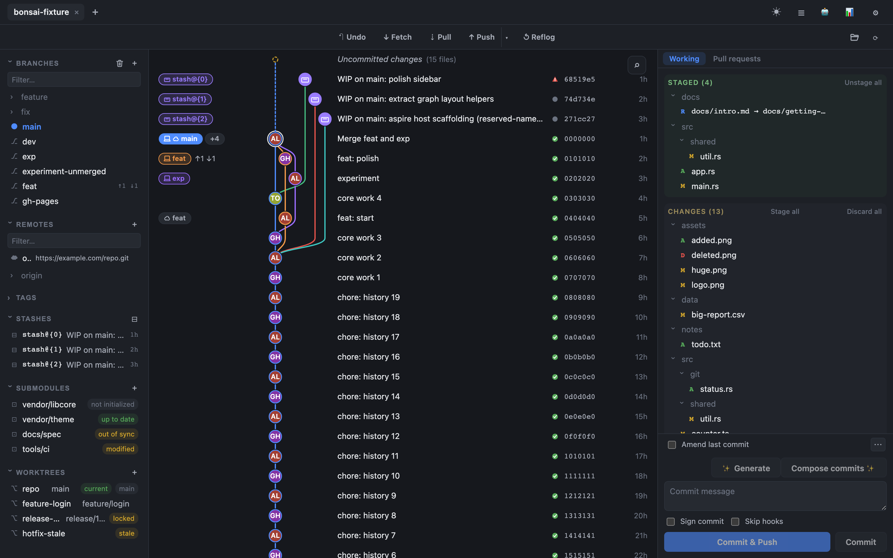
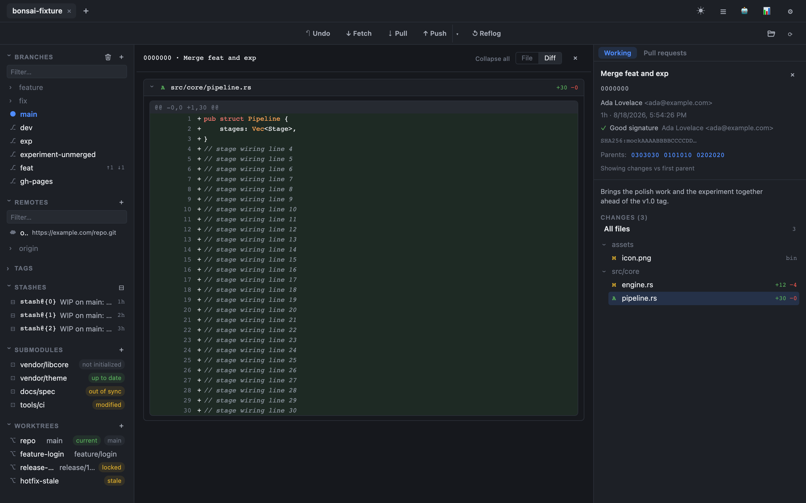
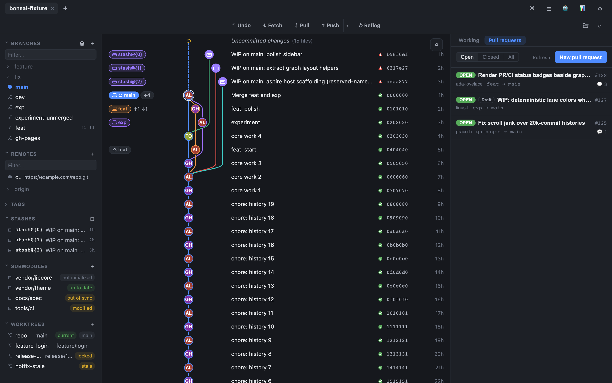
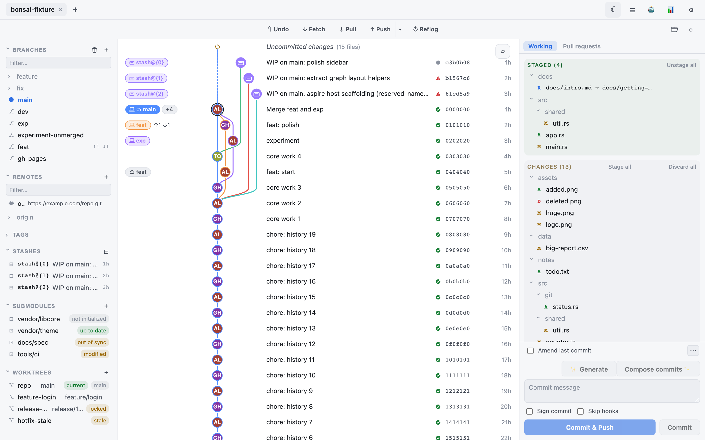

<div align="center">


# Bonsai

**A fast, native-feeling desktop Git client built around a rich, multi-lane commit graph.**

Cross-platform (Windows · macOS · Linux) · Built with Tauri, Rust, and React.

</div>

---

Bonsai is a local Git client built around a smooth, multi-lane commit graph. Rust owns all of
the Git logic and the graph-layout math via [libgit2](https://libgit2.org/); the UI only
renders — so the graph stays fast even over histories of 20,000+ commits.

> **Status: shipping `1.5.0`.** `1.0.0` was the first public release (2026-08-18); `1.1.0`
> through `1.5.0` have shipped since. The app is feature-complete for everyday Git work on
> Windows, macOS, and Linux — see the [CHANGELOG](CHANGELOG.md).
>
> **The forge / pull-request features are the least battle-tested part.** Listing, reading,
> opening, merging, and closing PRs is implemented for GitHub, GitLab, Bitbucket, and Azure
> DevOps and covered by tests against the mock harness, but not every provider has been
> exercised against real access tokens on a real repository — expect rough edges there.
> Everything else is release-ready.

## Screenshots

|                                                                      |                                                                    |
| :--------------------------------------------------------------------: | :------------------------------------------------------------------: |
|  |  |
| **Commit graph & staging** — multi-colored branch lanes, ref pills, and file-level staging in the same view. | **Commit diffs** — select any commit to see it diffed against its first parent. |
|  |  |
| **Pull requests** — connect GitHub, GitLab, Bitbucket, or Azure DevOps to list, read, and open PRs. | **Light theme** — every view adapts to a light or dark theme. |

_Captured against the mock-IPC browser harness with fixture data — see
[docs/assets/screenshots/README.md](docs/assets/screenshots/README.md) for what's shown and how
to regenerate these._

## Features

- **Rich commit graph** — multi-colored branch lanes, smooth curved fork/merge
  edges, and ref pills for local branches, `origin/*` remotes, tags, and HEAD. Virtualized
  on a canvas so scrolling stays smooth over very large histories. Large histories stream in
  batches, so the first screenful paints immediately and the rest arrives in the background.
- **Three-pane workspace** — branches / remotes / tags on the left, the graph in the center,
  and working-directory status, diffs, commit details, and per-branch CI checks on the right.
  The sidebar is a keyboard-navigable tree, and single-clicking a ref reveals it in the graph.
- **Stage & commit** — file-level staging/unstaging and commit, with author/committer taken
  from your Git config.
- **Diffs** — for both working-directory changes and any commit you select (vs. its first
  parent), including per-line discard of unstaged changes.
- **Branches & remotes** — create, checkout, and delete branches; check out any commit into
  detached HEAD straight from the graph or a ref pill; fetch, fast-forward pull, push, and
  force-push-with-lease. Tags are synchronised and marked local-only / remote-only / diverged.
- **History tools** — reflog viewer with restore, `git bisect`, merge, rebase, and stashes,
  all with in-app conflict resolution.
- **Git-activity log** — a dock streaming live git phases and progress, so you can see exactly
  what Bonsai ran and how far it got.
- **Repository management** — multiple repos open in tabs, named worktrees, background
  auto-fetch, first-run onboarding, in-app Git config editing, a repo-health dashboard, and a
  stale-branch cleanup review.
- **Commit identities** — multiple Git identities with a color assigned to each, so the header
  shows at a glance which one your next commit will carry.
- **Search & command palette** — commit/content search, a `Ctrl`/`Cmd`-K command palette, and
  filtering for the sidebar lists.
- **Pull requests** — connect one or more GitHub, GitLab, Bitbucket or Azure DevOps accounts
  with a personal access token to list, read, open, merge, and close/decline PRs, with PR and CI
  badges in a dedicated forge column beside the graph and a per-branch "Checks" tab. A PR's
  changed files and per-file diffs are computed **locally** from base…head, so line counts are
  correct on every forge. Not yet exercised against real access tokens on every provider — see
  the status note above.
- **Auto-update** — checks a signed release manifest and updates in place (opt-in).
- **AI features (optional, local)** — everything AI runs through the
  [Claude Code CLI](https://docs.anthropic.com/en/docs/claude-code) installed on your own machine,
  under your own subscription; nothing goes to Bonsai servers. Merge-conflict resolution with a
  live streaming log, cancel, mid-run questions and a "resolve all conflicts" option; commit
  messages and a WIP→commits composer; explain-commit and blame-why; semantic history search;
  changelog and PR-description drafting. AI is off until you enable it and accept the consent
  dialog, which spells out what is sent.
- **AI-ready for other tools** — an embedded MCP server exposes structured Git data (graph,
  diffs, conflicts) to AI tools, plus an optional "what changed" digest.

## Install

Prebuilt installers are attached to each [GitHub Release](https://github.com/danpercic86/bonsai/releases).

> **Note — v1 builds are unsigned.** Bonsai does not yet use OS code signing, so the first
> launch shows a publisher warning. This is expected; here's how to proceed:
>
> - **Windows** — the SmartScreen dialog says "Windows protected your PC". Click
>   **More info → Run anyway**.
> - **macOS** — Gatekeeper may block the first launch. **Right-click the app → Open**, then
>   confirm; or allow it under **System Settings → Privacy & Security → Open Anyway**.
> - **Linux** — for the `.AppImage`, make it executable (`chmod +x Bonsai_*.AppImage`) and
>   run it; or install the `.deb`.

OS code signing (Authenticode / Apple notarization) is planned for a later release — see
[docs/code-signing.md](docs/code-signing.md).

## Build from source

**Prerequisites** (all platforms):

- **[Rust](https://rustup.rs/) 1.97** — the channel is pinned by
  [`rust-toolchain.toml`](rust-toolchain.toml), so rustup installs the right toolchain (plus
  `clippy` and `rustfmt`) on first build.
- **Node 22+** and **[pnpm](https://pnpm.io/)** — the repo pins pnpm `11.17.0` via
  `packageManager`, which itself requires Node >= 22.13. CI builds on Node 22.
- **The Tauri CLI** — installed by `pnpm install`; no global install needed.

Plus a per-OS toolchain for building libgit2 and the native webview:

- **Windows** — MSVC build tools (the "Desktop development with C++" workload); WebView2
  (bundled on Windows 11, otherwise install the Evergreen runtime).
- **macOS** — Xcode Command Line Tools (`xcode-select --install`); the system WebKit is used,
  so there is nothing else to install.
- **Linux** — a C toolchain plus the GTK/WebKit development packages. On Debian/Ubuntu, these
  are exactly what CI installs:

  ```bash
  sudo apt-get update && sudo apt-get install -y build-essential \
    libwebkit2gtk-4.1-dev libappindicator3-dev librsvg2-dev patchelf libssl-dev
  ```

  Note **webkit2gtk 4.1** specifically — Tauri v2 links against 4.1, and the older `4.0`
  packages will not satisfy it. Other distributions need the equivalent packages.

```bash
pnpm install
pnpm tauri dev      # run the app in development
pnpm tauri build    # produce a release build + installers
```

The first build vendors and compiles libgit2 — expect ten-plus minutes. It is not stuck.

Frontend-only development (no native window) runs against mock Git data in a plain browser:

```bash
pnpm dev:mock       # Vite in mock mode; open the printed URL (port 1420)
```

## Contributing

Setup, architecture rules, and the checks CI enforces are in
[CONTRIBUTING.md](CONTRIBUTING.md); the full test-tier reference is in
[TESTING.md](TESTING.md).

## Tech stack

- **Backend** — Rust, [Tauri v2](https://v2.tauri.app/), `git2` (libgit2), `notify`, `serde`.
- **Frontend** — React + Vite + TypeScript, with `lucide-react` for all chrome icons; the commit
  graph is drawn on `<canvas>`.
- **Package manager** — pnpm.

## License

[MIT](LICENSE) © 2026 Dan Percic
